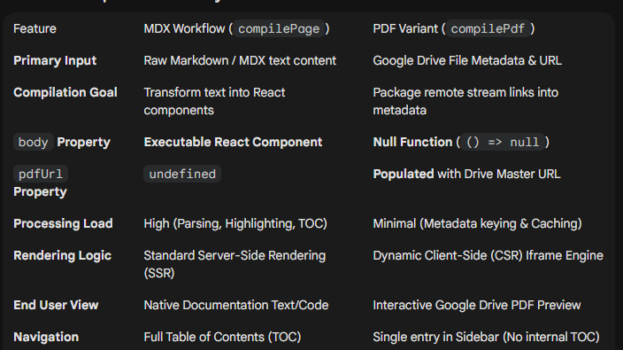

## Next.js Fumadocs

View the Next.js docs with Fumadocs.

Google-drive.ts fails to carryout

## Key PDF flow
```
client side: Google Drive links to /preview endpoints for reliable iframe embeddin
next/dynamic: prevent SSR confligcts and greenlight to browser load
Dual UI: in-page view (preview) and Open in Drive (hi def downdload view) 
```

### compilePage vs compilePdf


## (future path) turning from file-typ routing to metadata routing

Implement "Page Intent" Metadata: Transition from file-type detection to a metadata-driven approach (e.g., type: "gallery" or type: "bi") to explicitly signal which renderer to use.

Establish a Component Registry: Expand pdf-bodies.ts into a universal page-renderers.ts that maps specific intent types to their corresponding functional modules.

Utilize Dynamic Imports: Implement next/dynamic within the registry to ensure heavy libraries (like D3 for BI or Masonry for Galleries) only load when those specific pages are accessed.

Extend the Content Payload: Generalize the CompiledPage interface to support diverse data structures, such as image arrays for galleries or API endpoints for BI dashboards.


## Inline Render of PDF
```
Key Highlights of the New Deployment
Dynamic Rendering Route: The page.tsx now functions as a "router" that automatically detects if a file is a PDF or MDX/Markdown.

Ready-to-Use PDF Previewer: Instead of a simple object tag, the system now uses a robust iframe in compilePdf.tsx to provide a full-screen, interactive PDF previewer compatible with Google Drive streams.

Custom Override Registry: The pdf-bodies.ts file acts as a dedicated registry, allowing you to swap the default viewer for high-performance libraries like react-pdf on a per-file basis without affecting the rest of the site.

Theme Consistency: Standard text-based documents continue to use your custom mdxComponents (handling styling differences between /app and /pages), ensuring no loss of existing functionality.

How it Differs from the Previous Version
Resolution of Type Errors: The previous version failed to compile because it tried to force PDF components and MDX components into the same TypeScript definition. The new version uses a polymorphic wrapper (BodyContent) that supports both.

Integrated Viewing Experience: Previously, PDFs were handled as standard content or basic objects. Now, they are treated as a distinct "optimal route" that prioritizes in-browser viewing.

Performance Optimization: By decoupling the PDF logic, you avoid loading MDX-related styling logic for PDF files and vice-versa, making the page weight lighter for whichever document type is being viewed.
```
## PDF:
```
Added a cached compilePdf helper to mirror MDX compilation for PDFs, supporting optional body renderers alongside metadata. 

Switched Google Drive PDF entries to load through compilePdf for a consistent page tree pipeline. 

Allowed docs pages to render custom PDF body components while keeping the default viewer fallback. 
```

## failed attempt: cover json and txt in /Docs route
- modify compile-md and Docs/[..slug]/page to cover json and text
- page-like UI with TOC
- poor json and text TOC response
- heavy page build load upon [..slug] page path, irresponsive page load

## Authentication

Add the following environment variables to enable the Google-based NextAuth flow for Drive-backed docs:

```
- `GOOGLE_CLIENT_ID`
- `GOOGLE_CLIENT_SECRET`
- `AUTH_SECRET`
- `DRIVE_FOLDER_ID` (the folder that stores the docs)
```

Once configured, `/api/auth/[...nextauth]` will persist sessions and expose the Drive-scoped token as both `session.AccessToken` and `session.accessToken` for server-side content loading.

## Why the TOC/page tree is stale (shows deleted folders)

1) fetch(..., { cache: "force-cache" }), which tells Next/Vercel to cache 
【lib/drive/google-drive.ts】

 ```
  fetch calls to cache: "no-store" or set next: { revalidate: 0 }, which forces fresh
 ```
2) Docs pages are statically cached for 2 hours

export const revalidate = 7200;

【app/docs/[[...slug]]/page.tsx】

